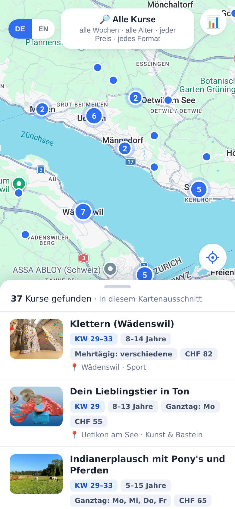
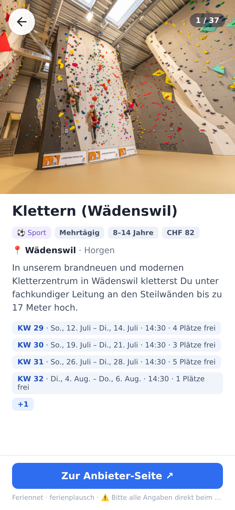

# 🏕️ KidsCampFinder

> **Find kids' holiday courses and camps across Canton Zürich — all on one map.**

During the Swiss school holidays there are hundreds of courses and camps for kids — sports,
coding, arts, language, nature — but they're scattered across dozens of separate websites,
mostly in German. Today a parent just Googles and hopes.

**KidsCampFinder gathers them all into one searchable map.** Pick a week, your child's age, a
topic or a price — see what's on near you, tap a camp for the details, and book on the
provider's own site (we just help you *find* camps; booking stays with them).

<p align="center">
  
  &nbsp;&nbsp;
  
</p>

It has two parts:

- a **crawler** (Python) that visits the provider sites/APIs, cleans the listings, and writes
  them into one database, and
- a **web app** (React) — a map-first browser for parents, plus an admin dashboard that shows
  how healthy the data is.

> 📚 Background docs: [`docs/PRD.md`](docs/PRD.md) (the product plan),
> [`docs/TDD.md`](docs/TDD.md) (the technical design),
> [`docs/research-sources.md`](docs/research-sources.md) (where the data comes from).

---

## 🚀 Try it (quick start)

You need **Python 3.11+** and **Node 20+**. Two steps, two terminals.

**1) Build the dataset** (the crawler — do this once to fill the database):

```bash
cd crawler
python3 -m venv .venv && source .venv/bin/activate
pip install -e .
python -m coursecrawler.run        # crawls everything, ~a few minutes
```

**2) Run the app:**

```bash
cd web
npm install
npm run dev                         # → https://localhost:5173
```

Open **https://localhost:5173** in your browser. (It's a self-signed HTTPS certificate in dev,
so you'll get a one-time "not secure" warning — click *Advanced → proceed*. HTTPS is on so the
"my location" button works.)

**Open it on your phone** (same Wi-Fi): run `npm run dev:host` instead — it binds the dev
server to your network and prints a `https://<your-computer-ip>:5173` URL. Open that on the
phone and accept the cert warning once.

---

## 📱 The web app

**Map view (the main screen).** A full-screen map of Canton Zürich with camps as clustered
pins. As you pan/zoom, the result list updates to the area you're looking at.

- **Filter pill** (top): tap it to open the filter sheet — calendar week (KW), age range
  slider, topic, max-cost slider, format. The pill summarizes your current filters.
- **Result sheet** (bottom): drag it up/down (or tap the handle) to see more/fewer result
  cards; each card shows the image, week, age, format + weekdays, and price.
- **Camp detail:** tap a card or pin for a full-screen page. **Swipe up/down for the
  next/previous camp** (TikTok-style), **swipe sideways or use Back/← to dismiss.** The
  "Zur Anbieter-Seite" button links out to the provider.
- **📍 my location** (bottom-right), **DE/EN** toggle (top-left).

**Admin dashboard** at **`/#admin`** (also the 📊 button): crawl health over time, metadata
coverage (% with image / price / coordinates / …), counts by source/topic/commune, and a
"true potential if we crawl harder" estimate.

Screenshots of every view are in [`web/screenshots/`](web/screenshots/).

> Production-style run (one server serves the built app + API + images):
> `cd web && npm run build && npm run api` → http://localhost:8787

---

## 📦 What's in the box (current dataset)

- **~728 unique courses · 1,090+ dated occasions** across **14 sources**:
  - **Feriennet fleet (10 ZH instances)** — ferienplausch (regional, ~51 communes) +
    standalone communes: pfaeffikon, urdorf, neftenbach, thalwil, stadel, horgen,
    bachenbülach, glattfelden, oberengstringen.
  - **ferienprogramm.ch** (Winterthur region), **codora** (Zürich coding/robotics camps),
    **jugendsportcamps.ch** (Canton ZH Sportamt — via its public JSON API, filtered to a ZH
    bounding box), **friLingue** (Swiss residential language camps — fills the languages topic).
- Coverage: **97% images, 100% age + dated, ~98% price, ~99% commune, ~93% coordinates.**
- Images are downloaded and served locally; courses are grouped (a multi-week camp = one
  card, "runs N weeks / KW range"); cross-source duplicates are flagged; past occasions are
  hidden.
- Topic mix skews toward **sports** (jugendsportcamps is sport-heavy); coding is now better
  covered (codora). One street-name/non-ZH commune may slip through the bbox — the web
  layer's `inZH`/Bezirk lookup is the precise canton filter.

---

## 🏗️ Architecture

```
crawler/   Python 3.13 — adapters → normalize → SQLite        (data wrangling)
web/       Vite + React + TS + Express + better-sqlite3        (serving + UI + admin)
data/      coursecrawler.sqlite + images/  ← the contract between the two
docs/      PRD, TDD, source research, discovery interview
```

The two halves only share the **SQLite file** — no shared code. (Why Python+TS: see TDD §1.)

---

## 🔧 Crawler — useful commands

```bash
cd crawler && source .venv/bin/activate

python -m coursecrawler.run                          # crawl everything (cached & idempotent)
python -m coursecrawler.run --only feriennet         # just one source
python -m coursecrawler.run --only feriennet --limit 20 --skip-images   # quick test
python -m coursecrawler.run --no-cache               # bypass the HTML cache (fetch fresh)
python -m coursecrawler.run --report                 # print the dataset report only
```

A weekly refresh is just re-running the crawl (e.g. via cron). The runner prints a per-source
summary and a **breakage alert** if any source suddenly drops to ~0 records.

---

## ✅ Status & next steps

**Done:** Feriennet fleet adapter (one parser, **10 ZH instances**), ferienprogramm.ch,
**codora** (static WordPress/MEC), **jugendsportcamps.ch** (public JSON API, ZH-bbox
filtered), **friLingue** (static, residential language camps), normalization (topics, KW
derivation, price/age parsing incl. school-grade→age and birth-year→age, language detection,
snippets), local image fetch, commune geocoding, cross-source dedup, the parent browser, and
the admin dashboard.

**Untapped headroom** (still on the table):
- **Other holiday periods** — only the active (summer 2026) period is published on Feriennet
  right now; autumn/winter/spring add ~2× once communes publish them.
- **Logiscool** (Zürich coding) — *deferred*: bookable camps load behind a cookie-consent
  gate + booking-widget interaction (no programs API on render, Nuxt SSR state has only CMS
  config). Low ROI since codora already covers Zürich coding/robotics. Revisit via the
  booking API or a click-driven Playwright flow if it becomes important.
- jugendsportcamps is national (~880); we keep the ~217 inside a ZH bounding box.
- More Feriennet ZH instances beyond the ten probed (long-tail, mostly tiny).

Note: the crawler has Playwright (Python) available for JS-only sources, but every shipped
source needed only HTTP — jugendsportcamps had a JSON API; codora/friLingue/ferienprogramm
are server-rendered. (Evaluated then skipped as low-ROI/off-scope: **Logiscool** — booking-widget
walled; **codecampworld** — weekly term courses, not holiday camps; **Zoo/Technorama** —
teaser-nav / booking systems; **kinder-camps** — JS + national dilution.)

**Known caveats:**
- ferienprogramm.ch spans the Winterthur–Thurgau border, so some communes are outside ZH —
  the web layer's Bezirk/`inZH` lookup is the precise canton filter (out-of-canton camps fall
  into an "Ausserkanton" bucket).
- One open data issue is documented for the crawler:
  [`docs/ISSUE-jugendsportcamps-urls.md`](docs/ISSUE-jugendsportcamps-urls.md).
- Topic classification (a nice-to-have filter) is keyword-based; ~good but not perfect.
- ToS/scraping was treated leniently per project scope (local/personal); revisit before any
  public/commercial use (see PRD §13).
